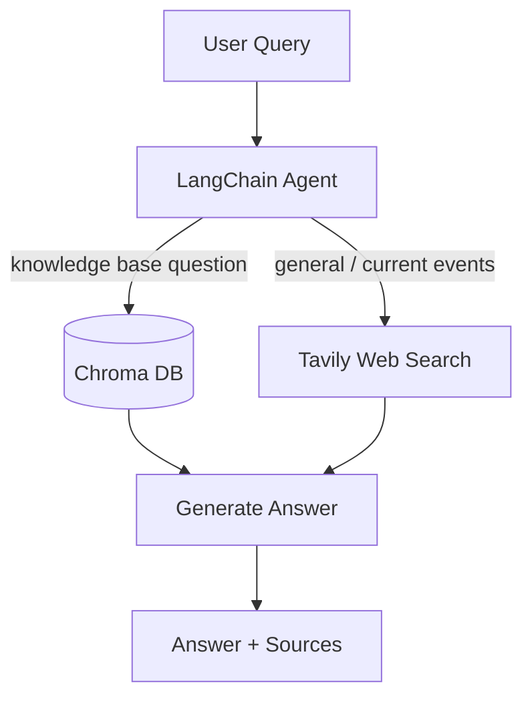
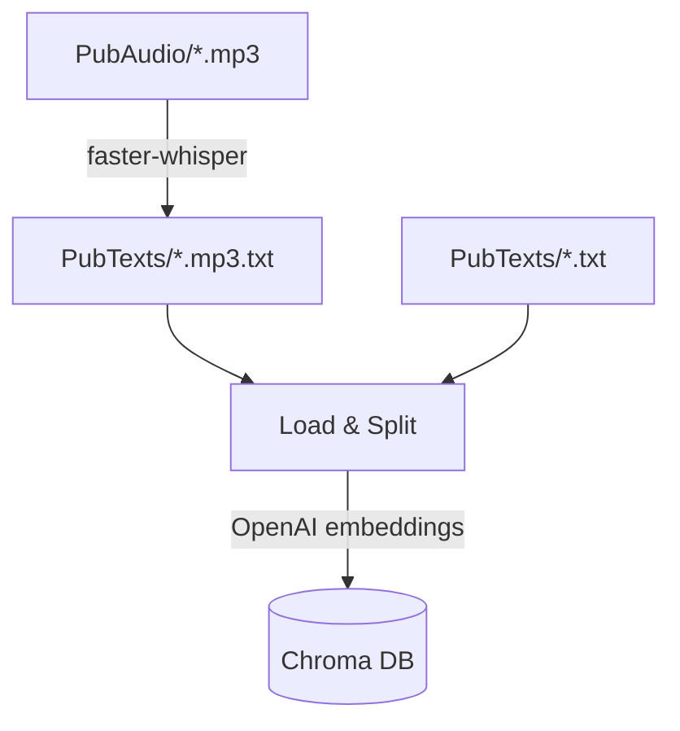

# PubQuiz Agent

A LangChain-based agent that answers pub quiz questions using a combination of tools: a local vector database and web search. Originally built with a now-deprecated version of LangChain in January 2024 at an event hosted by HMS in Heidelberg.

<video controls width="100%" muted>
  <source src="https://github.com/joweyel/pubquiz-agent/raw/main/assets/video.mp4" type="video/mp4">
</video>

https://github.com/user-attachments/assets/615227bc-53ec-4044-974c-162a3b83e4da

## Features

- **RAG pipeline**: local knowledge base with German criminal law, Romeo and Juliet, The Gift of the Magi, and German government speeches
- **Web search**: Tavily search for current events and general knowledge
- **Audio transcription**: faster-whisper (cpu) for ingesting audiofiles into the knowledge base
- **Streamlit UI**: Chat interface
- **LangSmith observability** : Tracing and evaluation via LangSmith

## Project Structure

```
pubquiz-agent/
├── main.py                 # Streamlit frontend
├── eval.py                 # LangSmith evaluation pipeline
├── test_questions.py       # Verified Q&A pairs for evaluation
├── src/
│   ├── agent.py            # LangChain agent + run_llm()
│   ├── tools.py            # Tool definitions (Chroma, Tavily)
│   └── ingestion.py        # Data ingestion pipeline (text + audio)
├── PubTexts/               # Text documents for the knowledge base
└── PubAudio/               # mp3 audio files for transcription
```

## How It Works



## Setup

1. Clone the repository
2. Install dependencies:
   ```bash
   uv sync
   ```
3. Copy `.env.example` to `.env` and fill in your API keys:
   ```
   OPENAI_API_KEY=...
   TAVILY_API_KEY=...
   LANGSMITH_API_KEY=...
   LANGSMITH_PROJECT=Pub-Quiz
   LANGSMITH_TRACING=true
   LANGSMITH_ENDPOINT=https://eu.api.smith.langchain.com
   ```

## Usage

### Ingest data

**`Pre-Requisite`**: Run ingestion to populate the vector database with data:

```bash
uv run python3 src/ingestion.py
```



### Run the app

```bash
uv run streamlit run main.py
```
Open the app at: http://localhost:8501/

### Run evaluation

```bash
uv run python eval.py
```

## Evaluation

**`Evaluation results are tracked in LangSmith:`**

[pubquiz-eval Dataset and Experiments](https://eu.smith.langchain.com/public/604da62e-14af-42d9-85a9-4e7d50d27016/d/compare?selectedSessions=95f9f4f4-85cd-447b-abcb-393e055486c5&activeSession=95f9f4f4-85cd-447b-abcb-393e055486c5)

**`LangSmith-Trace Example:`**

https://eu.smith.langchain.com/public/7260bac8-daad-43f3-8eb2-77ccdd665a35/r


## Tech Stack

| Technology                                                  | Purpose                      |
| ----------------------------------------------------------- | ---------------------------- |
| [LangChain 1.2](https://python.langchain.com/)              | Agent framework              |
| [LangSmith](https://smith.langchain.com/)                   | Observability and evaluation |
| [Chroma](https://www.trychroma.com/)                        | Vector database              |
| [faster-whisper](https://github.com/SYSTRAN/faster-whisper) | Audio transcription          |
| [Tavily](https://tavily.com/)                               | Web search                   |
| [Streamlit](https://streamlit.io/)                          | Frontend                     |